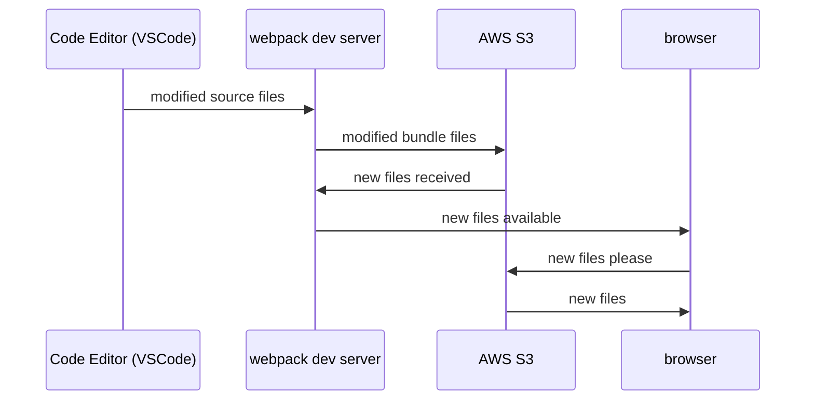

# Appendix A: Hot Reload

Here's how the hot reload sequence unfolds:

```mermaid
sequenceDiagram
    Code Editor (VSCode)->>webpack dev server: modified source files
    webpack dev server->>AWS S3: modified bundle files
    AWS S3->>webpack dev server: new files received
    webpack dev server->>browser: new files available
    browser->>AWS S3: new files please
    AWS S3->>browser: new files
```

Back to [README.md](README.md)
